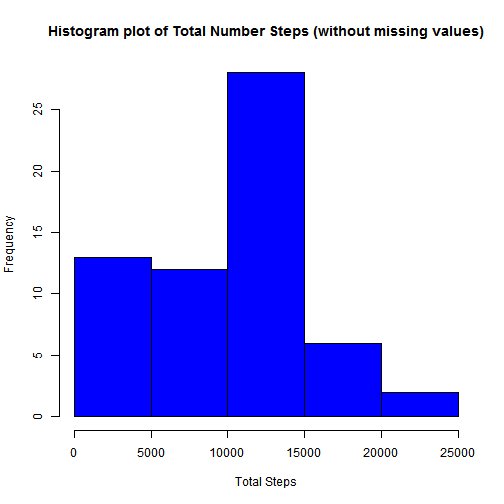
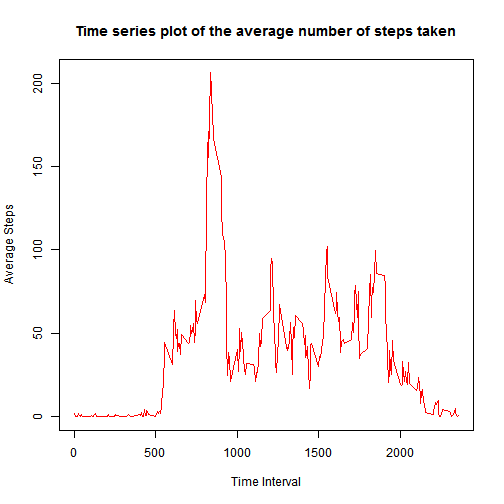
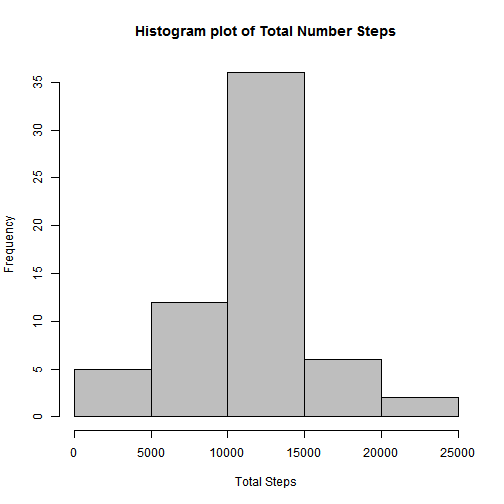
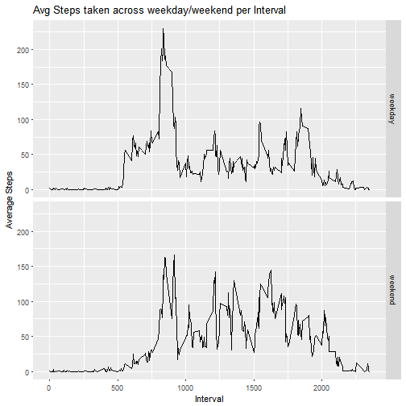

Reproducible Research - Week2 Assignment
=============================================

This assignment makes use of data from a personal activity monitoring device. This device collects data at 5 minute intervals through out the day. The data consists of two months of data from an anonymous individual collected during the months of October and November, 2012 and include the number of steps taken in 5 minute intervals each day.

Call required libraries for this assignment:

```r
library(dplyr)
```

1. Code for reading in the dataset and/or processing the data:
----------------------------------------------------------------

```r
actv <- read.csv("activity.csv",na.strings = "NA")
tail(actv)
```

```
##       steps       date interval
## 17563    NA 2012-11-30     2330
## 17564    NA 2012-11-30     2335
## 17565    NA 2012-11-30     2340
## 17566    NA 2012-11-30     2345
## 17567    NA 2012-11-30     2350
## 17568    NA 2012-11-30     2355
```

```r
actv$date <- as.Date(actv$date, format = "%Y-%m-%d")
str(actv)
```

```
## 'data.frame':	17568 obs. of  3 variables:
##  $ steps   : int  NA NA NA NA NA NA NA NA NA NA ...
##  $ date    : Date, format: "2012-10-01" "2012-10-01" ...
##  $ interval: int  0 5 10 15 20 25 30 35 40 45 ...
```

2. Histogram of the total number of steps taken each day:
----------------------------------------------------------------

```r
agg_step <- aggregate(actv$steps, by = list(actv$date), FUN = "sum", na.rm = TRUE)
hist(agg_step$x, col="blue", main = "Histogram plot of Total Number Steps (without missing values)", xlab = "Total Steps")
```



3. Mean and median number of steps taken each day:
----------------------------------------------------------------

```r
mnval <- mean(agg_step$x)
mdval <- median(agg_step$x)
```
Mean number of steps taken each day : 9354.2295082 

Median number of steps taken each day : 10395

4. Time series plot of the average number of steps taken:
----------------------------------------------------------------

```r
avg_step <- aggregate(actv$steps, by = list(actv$interval), FUN = "mean", na.rm = TRUE)
names(avg_step) <- c("interval","steps")
plot(avg_step$interval, avg_step$steps,type = "l", col = "red", main = "Time series plot of the average number of steps taken", xlab = "Time Interval", ylab = "Average Steps" )
```



5. The 5-minute interval that, on average, contains the maximum number of steps:
----------------------------------------------------------------

```r
max_avg <- max(avg_step$steps)
filter(avg_step, steps == max_avg)
```

```
##   interval    steps
## 1      835 206.1698
```

6. Code to describe and show a strategy for imputing missing data:
----------------------------------------------------------------
Calculate the total number of missing values in the dataset (i.e. the total number of rows with NAs)

```r
summary(is.na(actv))
```

```
##    steps            date          interval      
##  Mode :logical   Mode :logical   Mode :logical  
##  FALSE:15264     FALSE:17568     FALSE:17568    
##  TRUE :2304
```

Devise a strategy for filling in all of the missing values in the dataset. The strategy does not need to be sophisticated. For example, you could use the mean/median for that day, or the mean for that 5-minute interval, etc.

```r
actv1 <- filter(actv, is.na(actv$steps) == FALSE) #A data.frame with all valid steps
actv0 <- filter(actv, is.na(actv$steps) == TRUE)  #A data.frame with all NA steps
# A loop to put mean steps of that invertal for missing steps
for (i in actv0$interval) {
    actv0[actv0$interval == i, ]$steps <- avg_step$steps[avg_step$interval == i]
}
head(actv0)
```

```
##       steps       date interval
## 1 1.7169811 2012-10-01        0
## 2 0.3396226 2012-10-01        5
## 3 0.1320755 2012-10-01       10
## 4 0.1509434 2012-10-01       15
## 5 0.0754717 2012-10-01       20
## 6 2.0943396 2012-10-01       25
```

Create a new dataset that is equal to the original dataset but with the missing data filled in.

```r
actv_new <- rbind(actv0, actv1)
str(actv_new)
```

```
## 'data.frame':	17568 obs. of  3 variables:
##  $ steps   : num  1.717 0.3396 0.1321 0.1509 0.0755 ...
##  $ date    : Date, format: "2012-10-01" "2012-10-01" ...
##  $ interval: int  0 5 10 15 20 25 30 35 40 45 ...
```

7. Histogram of the total number of steps taken each day after missing values are imputed:
----------------------------------------------------------------
Make a histogram of the total number of steps taken each day and Calculate and report the mean and median total number of steps taken per day. Do these values differ from the estimates from the first part of the assignment? What is the impact of imputing missing data on the estimates of the total daily number of steps?

```r
agg_step_new <- aggregate(actv_new$steps, by = list(actv_new$date), FUN = "sum")
hist(agg_step_new$x, col="gray", main = "Histogram plot of Total Number Steps", xlab = "Total Steps")
```



```r
# Re-calculate mean and median of Total number of steps per day after filling missing values
mnval_new <- mean(agg_step_new$x)
mdval_new <- median(agg_step_new$x)
```
Mean number of steps taken each day : 1.0766189 &times; 10<sup>4</sup> 

Median number of steps taken each day : 1.0766189 &times; 10<sup>4</sup>

Observation: The mean and median values are highrer after replacing missing values comparing original dataset.

8. Panel plot comparing the average number of steps taken per 5-minute interval across weekdays and weekends
----------------------------------------------------------------

Create a new factor variable in the dataset with two levels - "weekday" and "weekend" indicating whether a given date is a weekday or weekend day.

```r
# Add a new column 'day' to hold day of the week
actv_new <- mutate(actv_new, day = weekdays(date))
# Add day category as 'weekend' and 'weekday'
actv_new$day_catg <- if_else(actv_new$day %in% c('Sunday','Saturday'), 'weekend', 'weekday')
actv_new$day_catg <- factor(actv_new$day_catg)
str(actv_new)
```

```
## 'data.frame':	17568 obs. of  5 variables:
##  $ steps   : num  1.717 0.3396 0.1321 0.1509 0.0755 ...
##  $ date    : Date, format: "2012-10-01" "2012-10-01" ...
##  $ interval: int  0 5 10 15 20 25 30 35 40 45 ...
##  $ day     : chr  "Monday" "Monday" "Monday" "Monday" ...
##  $ day_catg: Factor w/ 2 levels "weekday","weekend": 1 1 1 1 1 1 1 1 1 1 ...
```

Make a panel plot containing a time series plot of the 5-minute interval (x-axis) and the average number of steps taken, averaged across all weekday days or weekend days (y-axis).

```r
avg_step_week <- aggregate(steps ~ interval + day_catg, data = actv_new, FUN = "mean")
head(avg_step_week)
```

```
##   interval day_catg      steps
## 1        0  weekday 2.25115304
## 2        5  weekday 0.44528302
## 3       10  weekday 0.17316562
## 4       15  weekday 0.19790356
## 5       20  weekday 0.09895178
## 6       25  weekday 1.59035639
```

```r
library(ggplot2)
g <- ggplot(data = avg_step_week, aes(x = interval, y = steps))
g <- g + facet_grid(day_catg ~ .)
g <- g + geom_line()
g <- g + labs(title = "Avg Steps taken across weekday/weekend per Interval")
g <- g + labs(x = "Interval", y = "Average Steps")
print(g)
```



End of Assignment, Thanks.
